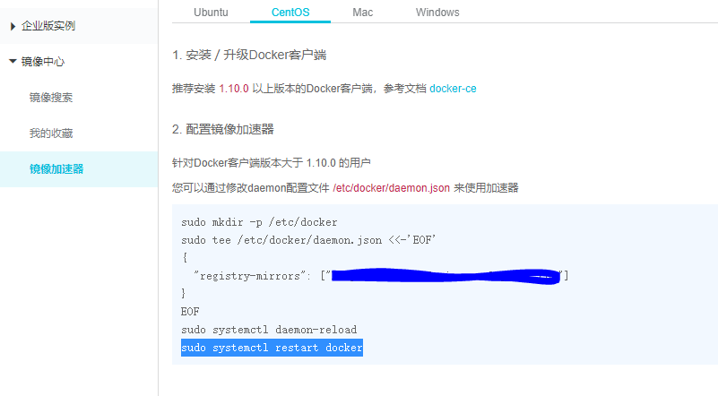

#### Centos安装需求
docker 需要运行在centos6.5以上，下面只适用于centos7+ 这里可以自行搜索官网进行安装
#### Centos 查看版本号
cat /etc/redhat-release
#### 准备工作11111
1. 需要安装gcc与c++
````
yum -y install gcc
yum -y install gcc-c++
````
2. 安装需要的软件包
````
yum install -y yum-utils device-mapper-persistent-data lvm2
````
3. 设置stable镜像仓库(需要注意官网的地址是国外网站，需要更换为阿里云，不然会出现--Tcp connection reset by peer,Timeout)
````
yum-config-manager --add-repo https://mirrors.aliyun.com/docker-ce/linux/centos/docker-ce.repo
````
4. 更新yum软件包索引
````
yum makecache fast
````
5. 安装Docker ce(社区版免费的) ee(企业版)
````
yum -y install docker -ce
````
6. 启动Docker与查看版本号
````
systemctl start docker
docker version
````
7. 配置镜像加速器
[阿里云](https://www.aliyun.com/tg/aliware/4829868.html "阿里云镜像加速器配置方法")

8. 查看加速器是否配置成功
````
ps -ef|grep docker
````
